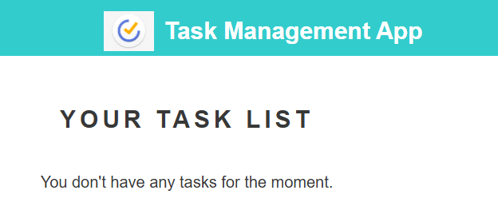
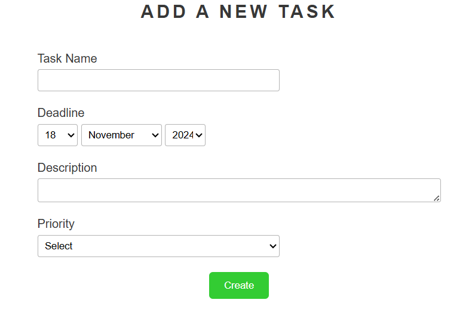
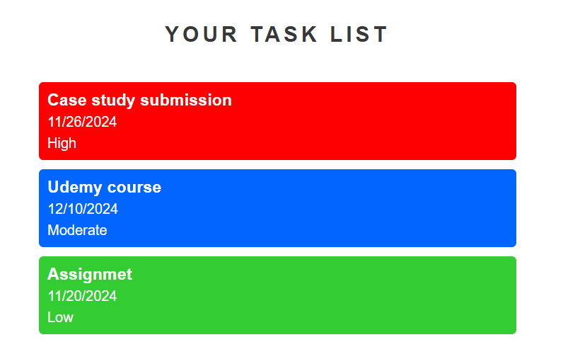

# Task Management App

The **Task Management App** is a simple yet powerful tool to manage your daily tasks. It allows you to create, edit, and delete tasks while assigning priorities and deadlines. This app uses local storage to save your data, ensuring persistence across sessions.

---

## Features

- **Task Creation**: Add new tasks with a name, description, deadline, and priority.
- **Task Management**: Edit or delete existing tasks with ease.
- **Interactive UI**: Clean, user-friendly interface with visual indicators for task priorities.
- **Local Storage Support**: Save tasks in the browser’s local storage for persistent task management.
- **Responsiveness**: Designed for optimal performance on both desktop and mobile devices.

---

## Technologies Used

### Frontend
- **HTML5**: Structure of the app.
- **CSS3**: Styling and responsiveness.
- **JavaScript (jQuery)**: For dynamic interactions and local storage handling.

---

 

 

